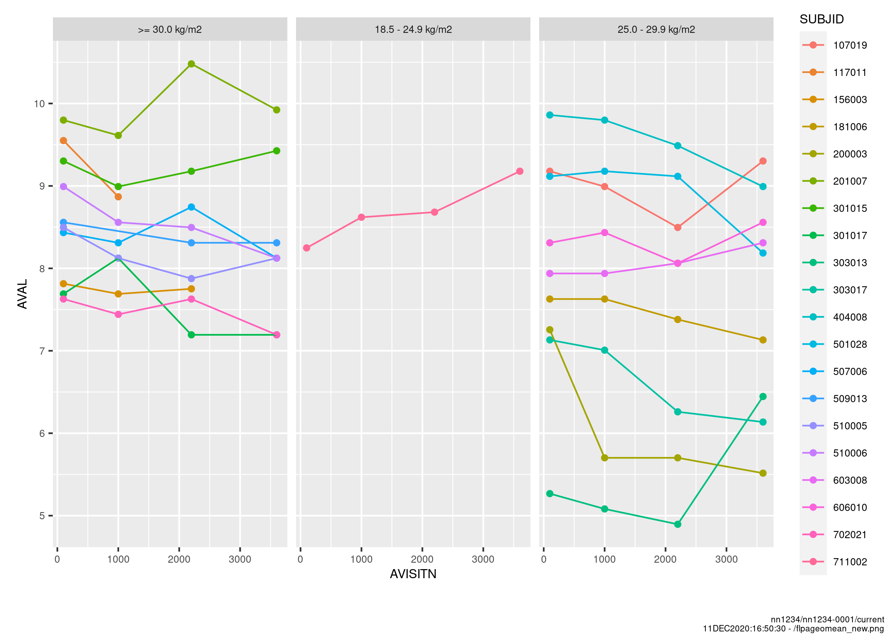
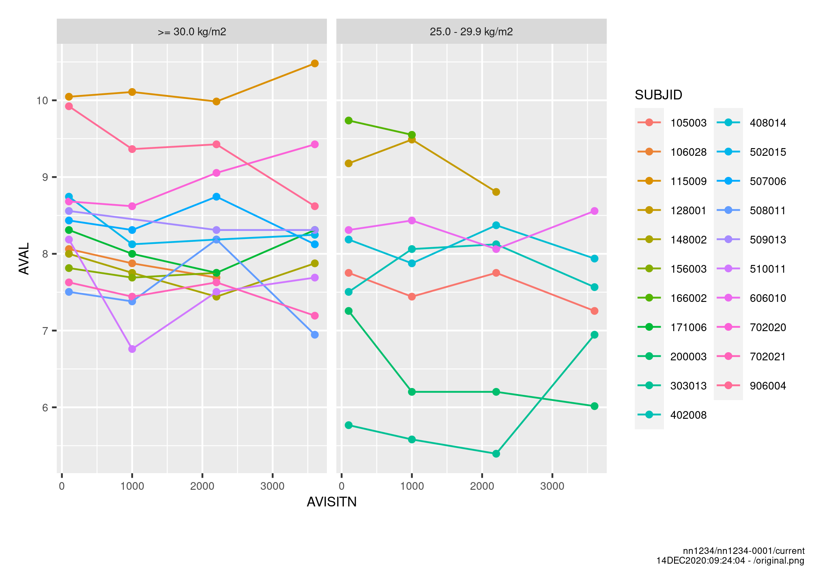
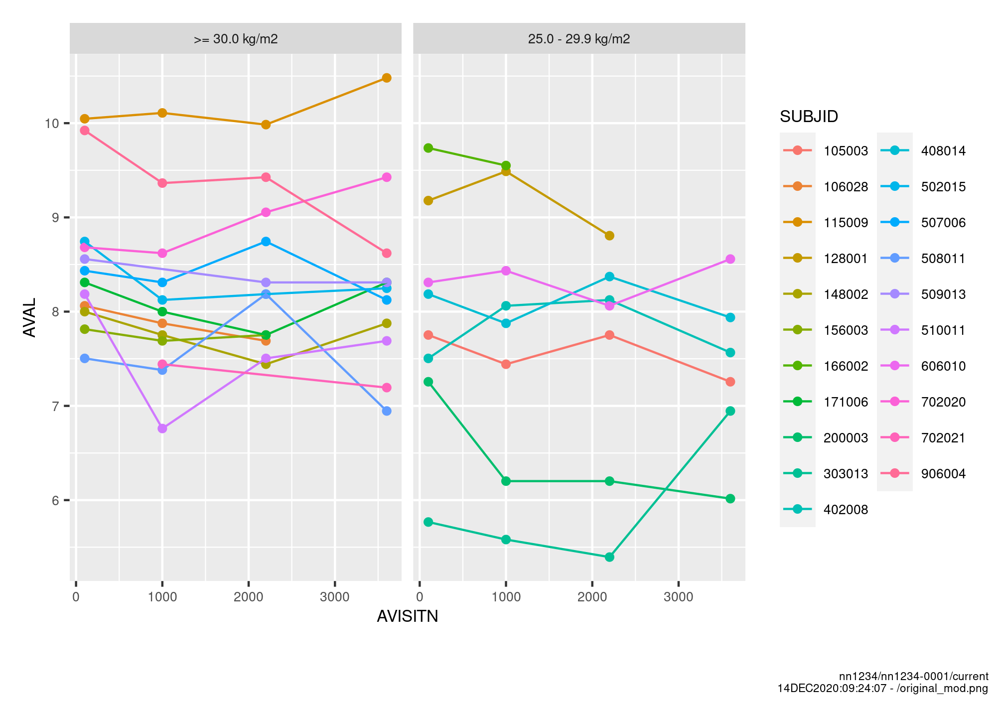

```{r setup, include=FALSE}
knitr::opts_chunk$set(
  collapse = TRUE,
  comment = "#>"
)
options(knitr.duplicate.label = "allow")
```

## Setup training data base
In case you have not already setup a training database please run
```{r}
NNtraining::createTrainingDB()
```
Assuming that you work on the R-server, this will copy the training data sets 
from the NNtraining package into your home directory in a sub folder called 
"training". If the files already exists, nothing will happen. The training 
folder can then be used to read/write from, as if it was a real trial folder on 
the p-drive.

## Introduction
In the NNcompare package the pngCompare() function is included for comparing png 
files. The function facilitates a pixel by
pixel comparison of two png files. This functionality could be 
useful when comparing png files between instances - e.g. when 
creating a new freeze instance to make sure that nothing has unintentionally
altered the plots.

## Example 1 - compare two png files
We compare the following two png files:
```{r, echo=FALSE, out.width="75%"}
knitr::include_graphics("flpageomean.png")

```

The png files are compared using the pngCompare() function, and the result of 
the comparison is shown below.
```{r,  out.width="75%"}
library(NNBiostat)
library(NNcompare)
# access to adam data and output datasets
# normally it is not necessary to specify the root argument
db <- nnaccess("4321", root = "~/training")
output_path = "~/training/nn1234/nn1234-4321/current/stats/output/"
flpageomean.png <- paste0(output_path, "flpageomean.png")
flpageomean_new.png <- paste0(output_path, "flpageomean_new.png")
pngcompare <- pngCompare(file1 = flpageomean.png, file2 = flpageomean_new.png)

pngcompare

plot(pngcompare)

```

## Example 2 - compare two png files
We compare the following two png files:
```{r, echo=FALSE, out.width="75%"}


```

The png files are compared using the pngCompare() function, and the result of 
the comparison is shown below.
```{r,  out.width="75%"}
original.png <- paste0(output_path, "original.png")
original_mod.png <- paste0(output_path, "original_mod.png")
pngcompare <- pngCompare(file1 = original.png, file2 = original_mod.png)
plot(pngcompare)

```

